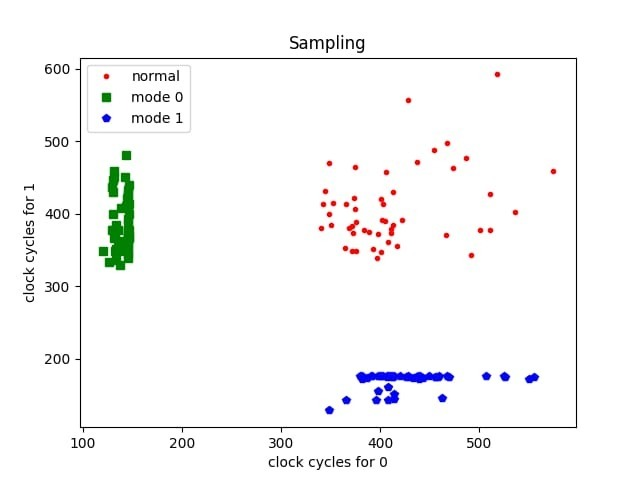
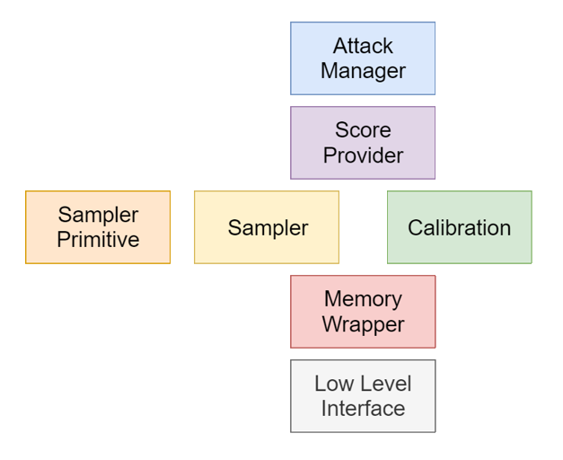

# Artik
Artik is a library for cache side channel attack. It was built as part of a workshop for cryptographic attacks in Tel Aviv University. 
This library was inspired by the [Mastik](https://github.com/Sanghyun-Hong/Mastik) library. 
## Requirements
- Linux enviorment x86 intel processor.
- CMake 3.5 or higher.
- C++ 14 or higher.
### hostapd Module
In order to install artik's modified hostapd, the following dependencies are required:
- libnl-3-dev 
- libssl-dev 
- libnl-genl-3-dev

See [Hostapd installation guide](docs/Hostapd.md) for more info.

## Goals
While buliding Artik we had the following goals in mind:
- Build a generic cache side channel attack that supports both Flush+Reload, Prime+Probe and should extends easily to future other attacks.
- Keep overhead of the library to minimum. Avoid as must as possible corrupting the cache by unnecessary copying or allocating.
- Offer an easy to use library for attacking cache.

## Does it work?



As one can see, there is a noticeable, significant difference between the measurements in different modes of the victim. 

So it works :) 

## Compilation
In order to compile Artik, run the following commands:
```console
$ mkdir build
$ cd build
$ cmake ..
$ make
```
After creating build for the first time you may use the same library.

In addition, you may want to compile a victim. The library provides few sample victims in `src/victims`. [BranchCodeWithLoop](src/victims/branch_code_with_loop.cpp) is our most used victim, and it can be compiled using the following command:
```console
g++ src/victims/branch_code_with_loop.cpp -o victim
```

## Structure


The library can be broken to 5 layers:
- Low level interface - in charge for abstracting machine specific code, serving as a wrapper for assembly function.
- Memory wrapper - abstraction for memory, works for every type of cache attack. 
- Sampler - Performs all the logic of sampling in each pattern
- Calibration and Score Provider - Calibration takes measurements and analyze the results
- Attack Manager - Coordinate the attack 

Each layer depends on the previous layer (which in turn abstract the previous layer and so on).


## Tests
We use gtest for unit test and have additional system tests. In order to run 
the unit tests, run  `ctest -V` in the build library.

## Code Example
```cpp
auto indices = { addr0, addr1 };
// Setup
auto primitive = std::make_unique<FlushSamplerPrimitive>();
auto sampler = std::make_unique<ListSampler>(
    indices,
    SAMPLE_MEASURE_DELAY,
    BETWEEN_ITEMS_DELAY,
    std::move(primitive));
auto average_sampler = std::make_unique<AverageSampler>(
    std::move(sampler),
    SAMPLE_ROUNDS,
    BETWEEN_ROUNDS_DELAY);
AttackManager attack(
    MemoryWrapper(path),
    AttackType::FlushReload,
    std::move(average_sampler));
attack.Calibrate();

// Attack
std::vector<Measurement> measurements;
std::vector<AttackResult> results;
attack.Attack(measurements, results);
for (const AttackResult& result : results)
{
    if(result.score < MIN_SCORE) { continue; }
    if(result.index == addr0)
        std::cout << "Option 0!" << std::endl;
    else if(result.index == addr1)
        std::cout << "Option 1!" << std::endl;
}
```

## Contributing
Pull requests are welcome. For major changes, please open an issue first to discuss what you would like to change.

Please make sure to update tests as appropriate. Also, we use [Gitmoji](https://gitmoji.carloscuesta.me/) in commit messages.

## License

[WTFPL](https://choosealicense.com/licenses/wtfpl/)
